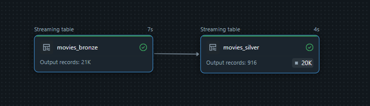
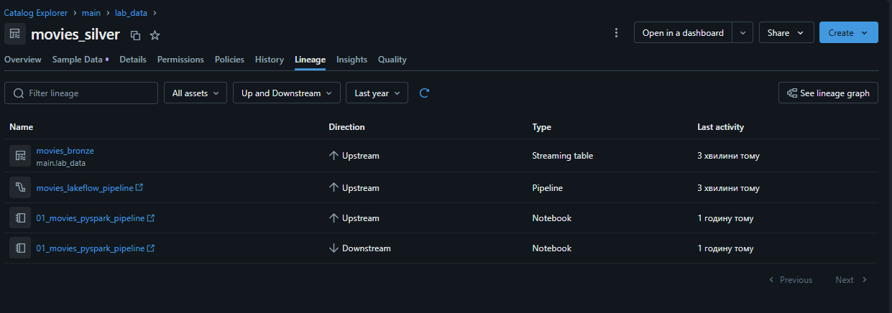

# Lab 5 — Declarative Pipelines / Lakeflow (Week 5)

## 📌 Overview
This lab demonstrates the implementation of a Lakeflow / Delta Live Tables (DLT) declarative data pipeline on Databricks. The pipeline processes raw movie data from an AWS S3 Volume using Auto Loader, enforces Data Quality Expectations at the Silver layer, and provides complete Data Lineage tracking.

---

## 🛠️ Pipeline Architecture & Implementation

The pipeline is implemented in `01_movies_declarative_pipeline.py` and consists of two layers:

1. **Bronze Layer (`movies_bronze`):**
   * Utilizes Auto Loader (`cloudFiles`) to stream raw CSV data from the Volume path `/Volumes/main/lab_data/movies_volume/`.
   * Enriches data with ingestion timestamps (`_ingested_at`).

2. **Silver Layer (`movies_silver`):**
   * Reads the streaming data from `movies_bronze`.
   * Applies data transformations (string trimming and type casting).
   * Enforces data quality constraints using `@dlt.expect_or_drop("valid_title", "title IS NOT NULL")`.

---

## 📊 Pipeline Results & Execution

### 1. DLT DAG & Expectations Evaluation
The pipeline executed successfully, ingesting 21K raw records into Bronze and validating 916 records into Silver, with 1 record dropped due to quality constraints.



### 2. Data Lineage Tracking
Unity Catalog automatically captures end-to-end lineage from the external S3 Volume storage down to the materialized Silver table.



---

## ⚖️ Declarative Pipelines vs Classic Spark Pipelines

| Feature / Aspect | Declarative (Lakeflow / DLT) | Classic Spark Jobs |
| :--- | :--- | :--- |
| **Pipeline Definition** | Declarative (`@dlt.table`, `@dlt.expect`) | Imperative (`spark.readStream`, `.writeStream`) |
| **Data Quality** | Built-in Expectation frameworks | Custom manual filtering / assertion logic |
| **Lineage & State** | Automatically managed by Unity Catalog | Requires explicit tracking and checkpoint management |
| **Cost & Compute** | Requires DLT/Serverless compute resources | Runs on standard All-Purpose / Job Clusters (more cost-efficient) |
| **Operational Effort** | Low maintenance, automated graph handling | Higher operational flexibility, full low-level control |

---

## 📦 Deployment with Databricks Asset Bundles (DABs)

The project includes a `databricks.yml` bundle definition enabling programmatic deployments via CI/CD pipelines.

To deploy this bundle manually:
```bash
databricks bundle deploy --target dev