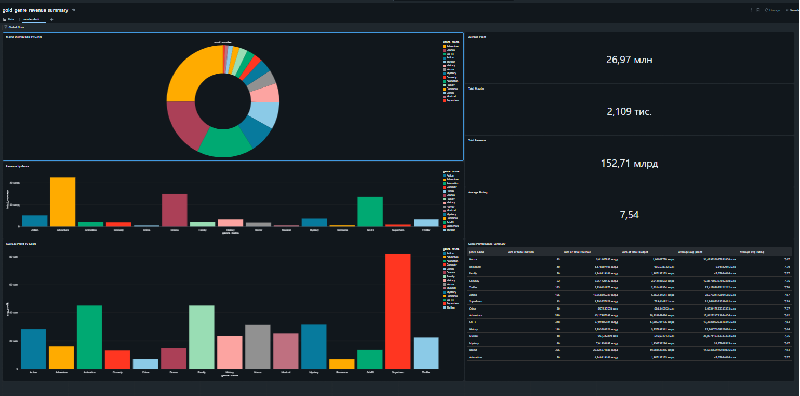
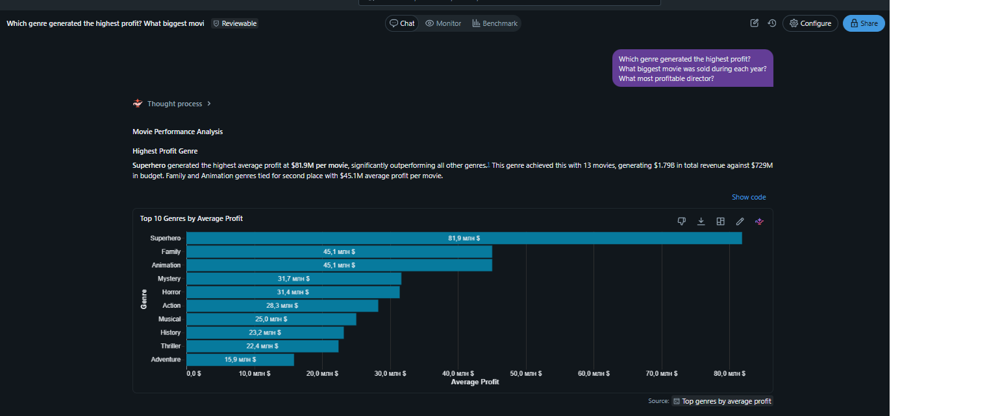
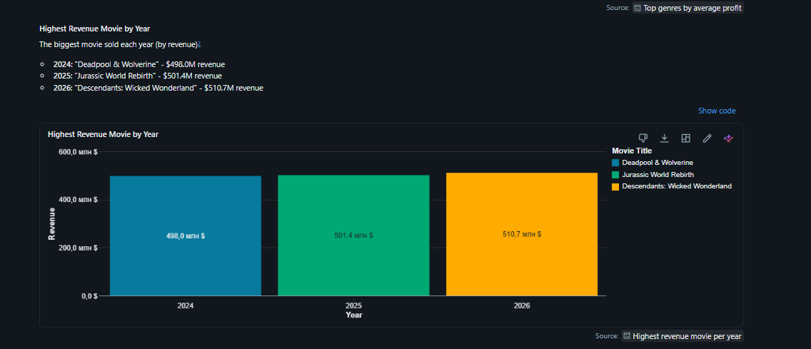
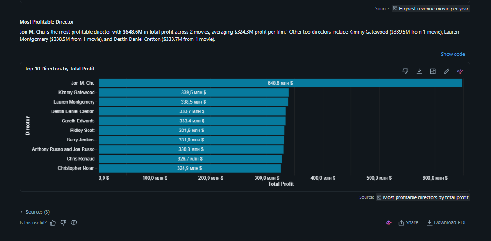
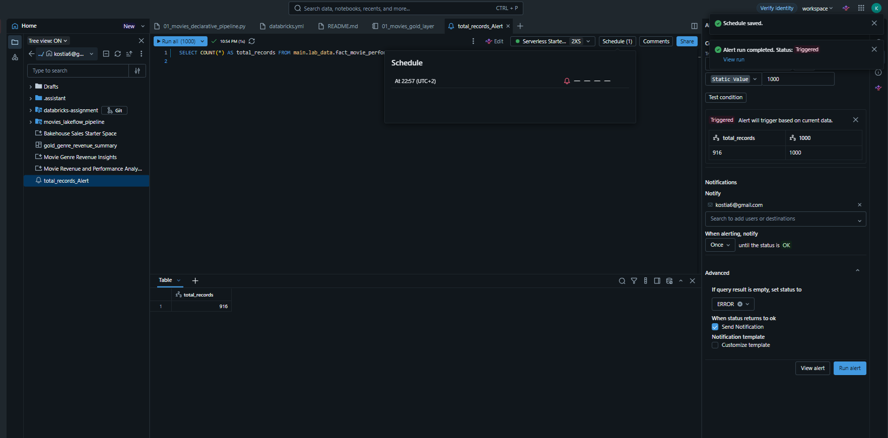
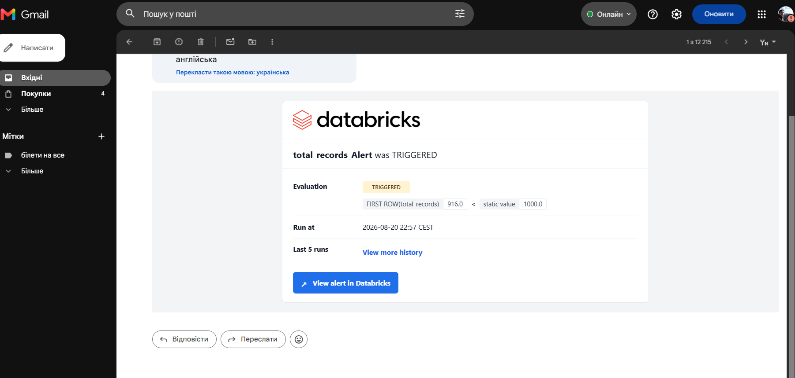

# Lab 6 — Gold Layer, AI/BI Dashboards & Data Governance

## 📌 Overview
This lab covers the end-to-end transformation of cleansed movie data into a business-ready **Gold Layer Star Schema**, interactive **Databricks AI/BI Dashboards**, natural language queries via **Genie Space**, automated **Data Volume Alerts**, and granular **Row-Level/Column-Level Security (RLS/CLS)** using Unity Catalog.

---

## 🏗️ 1. Gold Layer Architecture (Star Schema)

The Gold layer transforms relational data from `main.lab_data.movies_silver` into an analytical star schema optimized for BI reporting:

* **`dim_movies`**: Dimension table containing unique movie metadata (Title, Country, Director, Cast) using MD5 surrogate keys.
* **`dim_genres`**: Normalized dimension table breaking down multi-value genre strings into individual genre entities.
* **`fact_movie_performance`**: Core fact table capturing business metrics including `budget_usd`, `box_office_usd` (revenue), calculated `profit`, and release attributes.
* **`gold_genre_revenue_summary`**: Aggregated materialized data mart summarizing total revenue, budget, average profit, and average rating per genre.

---

## 📊 2. AI/BI Interactive Dashboard

An interactive Databricks AI/BI Dashboard was constructed over the Gold layer datasets to visualize business KPIs:
* **KPI Metrics**: Total Revenue ($152.71B), Total Movies (2.109K), Average Profit, and Average Rating.
* **Visualizations**: Genre Distribution Donut Chart, Revenue by Genre Bar Chart, and Genre Performance Summary Data Grid.
* **Filtering**: Integrated global interactive filters by Genre and Country.

---

## 🤖 3. Genie Space Natural Language Q&A

A Databricks **Genie Space** (`Movies Gold Analytics`) was created over the Gold fact and dimension tables, enabling non-technical stakeholders to perform natural language analysis.

### Sample Natural Language Queries:
1. **Query 1:** Genre performance analysis.
   

2. **Query 2:** Biggest movie sold.
   

3. **Query 3:** Top-performing directors and movies by box office revenue.
   

---

## 🚨 4. Automated Volume Drop Alerting

An automated SQL Alert was configured to monitor data freshness and volume consistency:
* **Query**: `SELECT COUNT(*) AS total_records FROM main.lab_data.fact_movie_performance;`
* **Trigger Condition**: Fires when `total_records < 1000`.
* **Status**: Successfully transitioned to `TRIGGERED` state, dispatching email notifications.

### Databricks Alert Execution:

### Email Notifications Received:

---

## 🔒 5. Data Governance (RLS & CLS)

Unity Catalog row filters and column masks were applied to enforce compliance and access restrictions:

* **Column-Level Security (CLS / Masking)**: Masked sensitive revenue data for non-admin roles using `CREATE OR REPLACE FUNCTION main.lab_data.revenue_mask`.
* **Row-Level Security (RLS)**: Dynamically filtered dataset rows based on geographic access permissions using `CREATE OR REPLACE FUNCTION main.lab_data.us_movies_filter`.