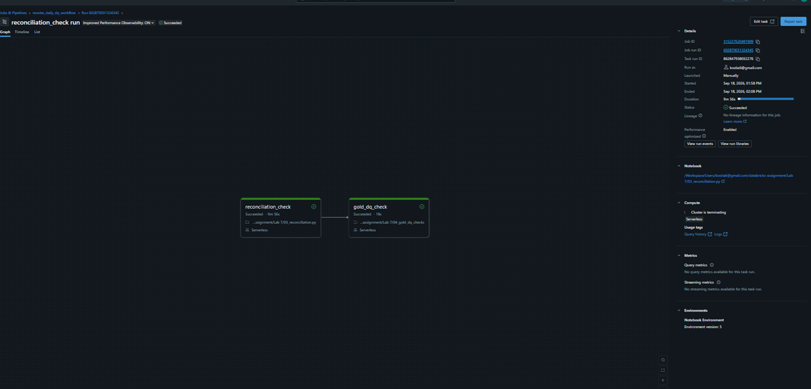

# LAB 7 — Data Quality Testing, Integrity Gates & Workflows

## Overview
This project establishes end-to-end data quality testing frameworks across code transformations, streaming ingestion, storage-level integrity, and scheduled audit workflows in Databricks.

## Part A: Unit Testing
* **Module:** `transforms.py` encapsulates isolated PySpark business transformations (`clean_silver_metadata`, `add_surrogate_movie_key`, `split_and_trim_genres`).
* **Test Suite:** `test_transforms.py` executes targeted tests via `pytest` to assert schema types, MD5 surrogate determinism, and string parsing logic.

## Part B: Data Quality Gates (DQX)

### 1. In-Pipeline Expectations & Quarantine Pattern
* **Pipeline:** `01_movies_dlt_pipeline.py`
* **Rules Enforced:** Completeness (`valid_title`) and Range Validity (`valid_release_year`, `valid_rating`).
* **Quarantine:** Invalid records are routed to `movies_quarantine` with categorized `failure_reason` attributes instead of being silently dropped.

### 2. Delta Lake Constraints (Storage Layer DDL)
* **Script:** `02_delta_constraints.sql`
* DDL operations are isolated into a standalone migration script.
* Enforces table-level integrity constraints (`CHECK (movie_id IS NOT NULL)` and `CHECK (length(title) > 0)`) directly on Gold tables (`dim_movies`, `dim_genres`).

### 3. Dynamic Reconciliation Audit
* **Notebook:** `03_reconciliation.py`
* **Parameterization:** Parameterized via Databricks Widgets (`catalog`, `schema`) for environment decoupling (DEV/PROD).
* **Audit Assertion:**
  $$\text{Bronze Count (21069)} = \text{Silver Count (916)} + \text{Quarantine Count (20153)}$$
* **Result:** **0 silent data loss** verified.

### 4. Gold Quality & Automated Workflow Job
* **Notebook:** `04_gold_dq_checks` enforces primary key uniqueness and non-null analytical dimensions.
* **Orchestration:** Scheduled Databricks Workflow (`movies_daily_dq_workflow`) executing `reconciliation_check` followed by `gold_dq_check`.

## Bonus: Databricks Labs DQX Framework
* **Demo:** `05_dqx_bonus_demo.py`
* Demonstrates declarative data profiling using the official `databricks-labs-dqx` engine (`DQEngine`, `DQRowRule`), validating metrics and summary scoring tables.