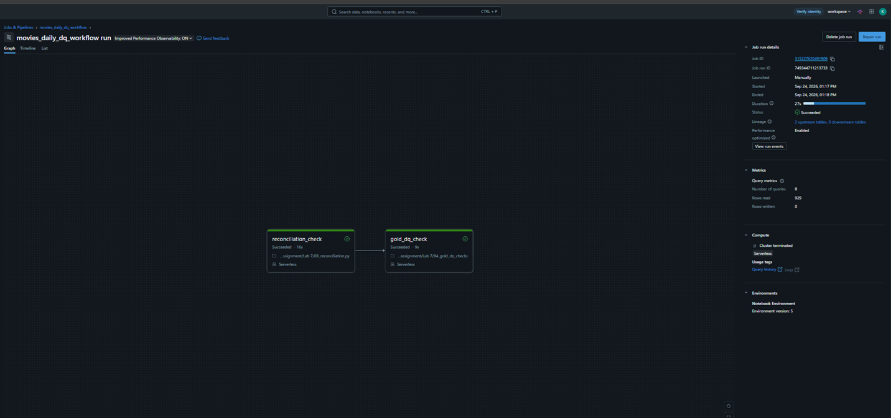

# LAB 9 — Databricks REST API & SDK Automation

## Overview
This module automates end-to-end platform operations on Databricks using the official Python Databricks SDK (`databricks-sdk`). It replaces manual UI triggers with a headless automation script designed for CI/CD environments.

## Core Capabilities
* **Compute Provisioning & Validation:** Verifies cluster availability and initiates startup via `w.clusters.ensure_cluster_is_running()` before executing workloads.
* **Programmatic Job Orchestration:** Triggers Databricks Workflows (`movies_daily_dq_workflow`, Job ID: `315227620491909`) via `w.jobs.run_now()`.
* **State Polling & Monitoring:** Implements polling via `w.jobs.get_run()` tracking transition states (`PENDING` $\rightarrow$ `RUNNING` $\rightarrow$ `TERMINATED`) with zero-exit-code guarantees on `SUCCESS`.

## Components
* `pipeline_runner.py`: Core automation driver leveraging `WorkspaceClient`.
* `requirements.txt`: Project dependencies (`databricks-sdk`, `python-dotenv`).
* `.env.example`: Secure configuration template for host, PAT token, and target Job ID.
* `run_test`: Verification notebook for headless execution within the workspace.

## CI/CD Pipeline Integration
Integrated with GitHub Actions (`.github/workflows/deploy.yml`):
1. **Validate:** Executes unit tests and validates Databricks Asset Bundles (DABs).
2. **Deploy:** Deploys bundles to PROD workspace.
3. **API Automation:** Headless runner step triggers and monitors PROD workflow run using encrypted repository secrets (`DATABRICKS_HOST_LAB9`, `DATABRICKS_TOKEN_LAB9`, `DATABRICKS_JOB_ID_LAB9`).

## Execution Evidence
Successful execution run (`Job Run ID: 749344711213733`):

